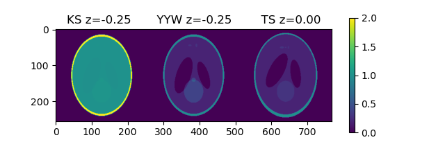

# sl3d
A python implementation of three-dimensional Shepp-Logan head phantom

Three variants, "Kak-Slaney" [1], "Yu-Ye-Wang"[2], "Toft-Schabel"[3] are implemented.


## Sample Code
```python
from matplotlib import pyplot as plt

nVoxelZ = 64  
nVoxelY = 256
nVoxelX = 256

phantom0, e = shepp_logan_3d(size_out=[nVoxelZ,nVoxelY,nVoxelX], phantom_type="kak-slaney")
phantom1, e = shepp_logan_3d(size_out=[nVoxelZ,nVoxelY,nVoxelX], phantom_type="yu-ye-wang")
phantom2, e = shepp_logan_3d(size_out=[nVoxelZ,nVoxelY,nVoxelX], phantom_type="toft-schabel")

plt.imshow(np.concatenate(
            [phantom0[3*phantom0.shape[0]//8],
             phantom1[3*phantom1.shape[0]//8],
             phantom2[  phantom2.shape[0]//2]],
            axis=1))
plt.colorbar()
plt.title("KS z=-0.25       YYW z=-0.25        TS z=0.00")
plt.show()
```

## Result



## License

3-clause BSD License

## References

[1] Kak AC, Slaney M, Principles of Computerized Tomographic Imaging, 1988. p.102
    http://www.slaney.org/pct/pct-errata.html

[2] Yu H, Ye Y, Wang G, Katsevich-Type Algorithms for Variable Radius Spiral Cone-Beam CT
    Proceedings of the SPIE, Volume 5535, p. 550-557 (2004)

[3] Matthias Schabel (2021). 3D Shepp-Logan phantom
    (https://www.mathworks.com/matlabcentral/fileexchange/9416-3d-shepp-logan-phantom),
    MATLAB Central File Exchange. Retrieved April 29, 2021.
